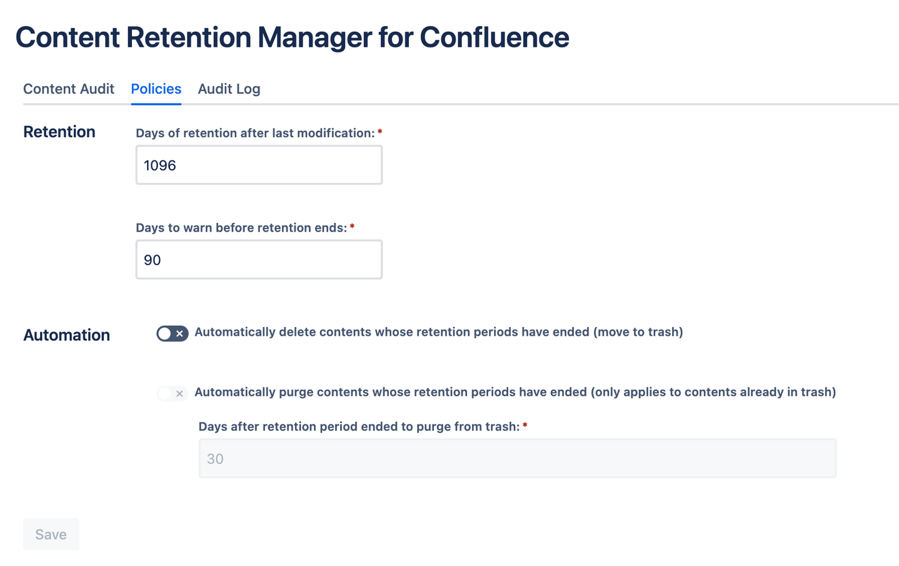
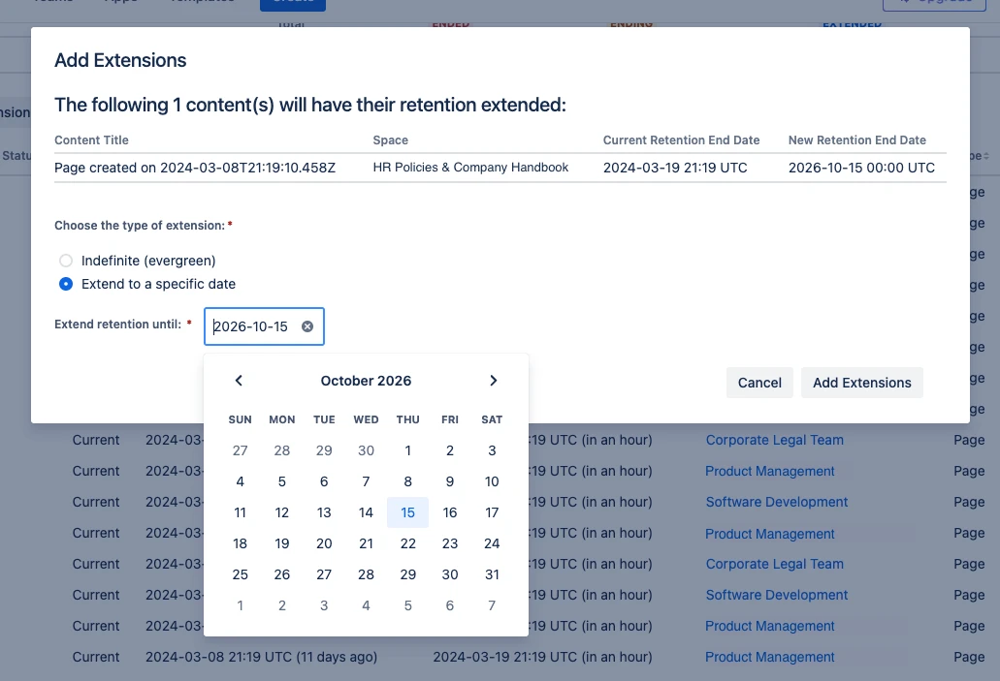

The following is intended to be a quick start for those familiar we data retention tools and are looking to quickly deploy Content Retention Manager for Confluence. This starter guide applies to both Content Retention Manager for Confluence and Content Retention Manager for Confluence - Lite with feature differentiation noted.

## In this guide we’ll do the following

1. Install the app
1. Set your policy
1. Audit your content
1. Grant exceptions
1. Deploy automated retention enforcement

## Prerequisites

1. A defined company policy on data retention or information governance. We’ll want to use this to define our policy within Content Retention Manager for Confluence.
1. An active Confluence Cloud space.
1. A user account with Confluence Admin (Site-Admin) privileges.

!!! warning

    We recommend trying our app out first on a development, test, or staging tenant first to familiarize yourself with the features and capabilities. This will help make sure the app conforms to your policies and expectations.

## Installation

1. Install [Content Retention Manager for Confluence](https://marketplace.atlassian.com/apps/1233769/content-retention-manager-for-confluence) on the Atlassian Marketplace on your desired Confluence instance.
1. You can find Content Retention Manager for Confluence in the **Confluence Admin** :gear: space under `Apps` on the left navigation pane.

## Setting up your Retention Policies

### Set your Retention Period and Warning

!!! danger "Leave automation off for now"

    You’ll want to audit your content first. If you turn automation on at this point, any expired content will be deleted and possibly irrecoverably purged from your space. Remember, the purpose of this app is to help with data compliance.

1. Click the `Policies` tab. Here you will set your team’s defined retention policy in days. The default retention policy is set to 3 years (or about 1096 days with a leap year). The days you set will help the audit tool flag all content that is nearing the end of the retention period or has expired past the retention policy. **At this point no content is being removed or purged, simply auditing.**

1. Set your desired warning period. This works backwards as a way to flag content slated for removal. This will help you keep an eye on things expiring before they expire. You’ll have a chance to reach out to the document owner and grant exceptions as needed.

1. **Leave automation off for now**. You’ll want to audit your content first. If you turn automation on at this point, any expired content will be deleted and purged from your space.

## Audit your content

1.  **Click on `Content Audit`**. Here you will find the dashboard that allows you to comb through all content by status against the defined retention policy. You can use `Filters` to sort through content that is in the following statuses:

    | Status    | Definition                                                                                                                                                                                                                  | Document Status           |
    | --------- | --------------------------------------------------------------------------------------------------------------------------------------------------------------------------------------------------------------------------- | ------------------------- |
    | Retained  | Content is in an active state and available. This means it hasn’t expired per your policy or any exceptions.                                                                                                                | Accessible & Discoverable |
    | Extended  | Content in which an admin has granted a specific retention policy that can either be shorter or longer than the company’s global retention period.                                                                          | Accessible & Discoverable |
    | Evergreen | Content in which an admin has extended the retention policy indefinitely. This content will never expire or be automatically removed.                                                                                       | Accessible & Discoverable |
    | Ending    | Content is nearing end of your retention period and you should determine if it needs to be granted an exception or if it’s ok to be removed.                                                                                | Accessible & Discoverable |
    | Ended     | Content has expired against your defined retention policy. When a retention period of content ends, the content is first Deleted (recoverable) then Purged (irrecoverable) after a defined period of time in your Policies. | Deleted / Purged          |

2.  Set exceptions by filtering for content that has Ended or is Ending which you would like to extend. You may want to also audit all active content for those which you may want to have an altered retention policy. Common use cases are Human Resources Content, Company Policies, Legal documents, and anything which you would like to be retained for a longer period. Remember, you can bulk edit multiple pieces of content to save time.

    a. **Defined Exceptions** - You can set an explicit retention period by content. This sets a specific date in the future you would like this content to conform to.

    b. **Indefinite “Evergreen” Exceptions** - This allows you to mark content such that it never expires against a retention policy.

    

## Remove Expired Content

!!! warning

    Only after you have audited your content and granted exceptions to your retention policies, should you begin removal of any content that has expired against your company’s defined retention period.

There are two methods for removal in Content Retention Manager for Confluence

1. _Manual_ - The admin can remove individual content or bulk remove all adhoc in the Content Audit tab. This is recommended for your first time using the content since it’s likely you will have a very large amount of content at first to remove.

1. _Automation_ - On the policy tab you can enable automated deletion and purging of content. This allows the app to routinely remove content from your instance based on it’s retention status. As content expires against the retention policy, it is first deleted, then purged based on your settings.

   a. **Automated Deletion** - Allows the app to automatically delete content as it expires against the retention policy. When content is deleted, it is not longer visible or recoverable to standard users, but is recoverable to Site and Confluence Administrators. Content that is deleted but not purged is also considered “discoverable” in terms of regulations, laws, and investigations.

   a. **Automated Purge** - Automated purge allows the app to fully remove content from your system after a period of time. At this point the content is irrecoverable to anyone and is no longer considered “discoverable.”

!!! warning

    Remember: Automated Purging happens on the set period of time after a document’s retention period has ended not from when it may have been deleted.

### Content Status

Atlassian has multiple status levels to understand on how content exists. Discoverability for investigations and compliance is considered any time anyone (including an admin) can access or recover content.

| Document Status   | Visibility                                                              | Discoverable |
| ----------------- | ----------------------------------------------------------------------- | ------------ |
| Current           | Anyone Can View (limited to the document’s visibility settings)         | :white_check_mark: |
| Archived          | Visible to document owner, Users can archive and unarchive content      | :white_check_mark: |
| Deleted / Trashed | Not generally visible but recoverable by Space and Confluence Admins    | :white_check_mark: |
| Purged            | No longer visible nor recoverable. Any trace of the content is removed. | :cross_mark: |

## Final Steps and Considerations
Remember, ongoing retention management is critical to conform to the array of laws and regulations, how you plan on enforcing is up to your team’s operational plan. With Content Retention Manager for Confluence to can decide how much automation or manual process you would like. We recommend starting with manual auditing and removal for a period of time as you get familiar with the product. This will also make sure you don’t accidentally remove something important.

### Discoverability and Liability is critical to understand
Archiving and Deleting is not enough, so long as someone can recover a file, it’s considered discoverable to most laws and regulations. So it’s important that you actively maintain a policy that factors in what you want to be discoverable according to your Legal and HR teams.

### Don’t forget the Audit Log
The Audit log is a permanent record for you to provide for any investigation to know who and when may have set or updated a policy, defined an exception, deleted, or purged content. If the content is deleted or purged by automation it’ll show up as such. The log only identifies content on a limited ID, it will not log the content itself.
